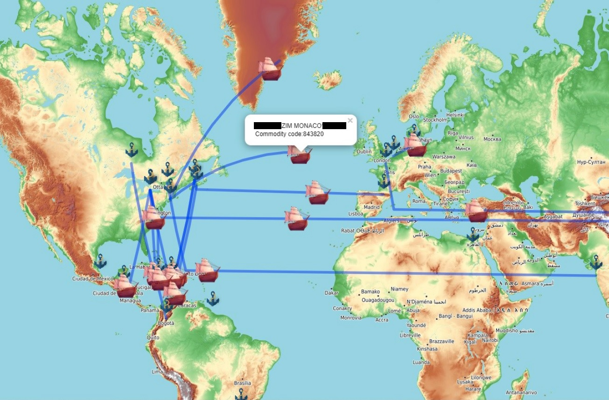

# Automated Worldwide Shipping Network Visualization using D3.js, Leaflet.js and GeoJSON

This project was built as part of the Visualization course (CSCI 6406) at Dalhousie University taught by Dr. Stephen Brooks.

Dataset: The data is a small set of open source EDI trade documents dealing with shipping container contents. All of the confidential and proprietary information was redacted or altered prior to the project due to the sensitivity of the data. The end dataset used for the project is similar in nature but not factual as the real life dataset.

This project combines concepts from regular expressions and NLP to automate the commodity code extraction and correction from EDI files. We then visualize the transaction paths between associated ports with corresponding vessel information and commodity codes in a world map to help ports track and take proper measures prior to goods arrival or departure.

We use D3.JS, Leaflet.js and GeoJSON.

The project can be divided in three parts:  
1st, <b>Parsing</b> of the required information from EDI files.  
2nd, <b>Automatic look up of port coordinates. </b>Notebook.ipynp is used to first obtain the source and destination port names. Then the python library geopi is used to find the coordinates of the ports to plot on the world map.  
3rd, <b>Building an animated path from source to destination port</b> I used polylines and leaflet.js for this part. 

The resulting visualization looks like this: 

